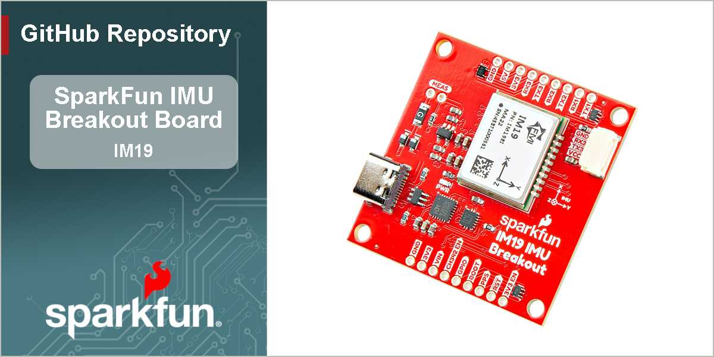

SparkFun 9DoF IMU Breakout - IM19
========================================

[*SparkFun 9DoF IMU Breakout - IM19 (SEN-30381)*](https://www.sparkfun.com/sparkfun-9dof-imu-breakout-im19.html)

The Feyman (FMI) IM19 attitude module combines MEMS sensor data with GNSS RTK positioning data to provide high-precision attitude measurements. This enables advanced features, like tilt-compensated surveying and robust navigation through brief GNSS outages.

- **Survey-Grade Accuracy:** Delivers roll and pitch measurements accurate to within 0.05 degrees.
- **Tilt Compensation:** No more perfectly vertical survey poles! The IM19 can calculate a virtual digital level point at any tilt angle, revolutionizing field data collection.
- **Sensor Fusion:** Offers a continuous navigation solution (Dead Reckoning) even during brief GNSS signal loss, making it ideal for urban or obstructed environments.

When fed with NMEA **`GGA`**, **`GST`**, and **`RMC`** messages at **5Hz**, and a standard **Pulse-Per-Second timing signal**, the IM19 attitude module will output a proprietary NMEA ASCII `GPFMI` message which contains the compensated position of the tip of your surveying pole, plus the Roll, Pitch and Yaw of the IMU itself.

Our Breakout provides access to all three IM19 UART interfaces. `UART1` and `UART2` are accessible via a CH342 dual-channel USB-UART interface. `UART3` is accessible via a 4-pin locking JST connector. All three UARTs can be accessed via breadboard-compatible breakout pads too. The CH342 can be disconnected by simply pulling the `CH342_EN` breakout pad low; allowing full access to `UART1` and `UART2` via the breakout pads.

Power can be provided by USB, or the `VIN` (5V nominal) breakout pad. With care, you can also connect an external 3.3V supply to the `3V3` breakout pads or `Pin 1` of the JST connector. A jumper allows JST `Pin 1` to be configured for 5V input / output.

The IM19 attitude module is centered on the center of the PCB, simplifying your LEVER_ARM calculations. There is no X,Y offset to consider. The Z origin is 1.6mm above the top surface of the PCB (inside the IM19 module package); 3.2mm above the bottom surface of the PCB.

The 1.7" x 1.7" PCB is the same size as some of our RTK GNSS Boards, making it easy to stack the IM19 above or below your existing GNSS breakout board.

> [!NOTE]
> The IM19 needs to be fed with GNSS positioning data with a RTK Fixed solution *(RTK Fix)* in order to work correctly. This board will not work with non-RTK GNSS receivers.

Documentation
-------------

- **[Hookup Guide (docusaurus)](http://docs.sparkfun.com/SparkFun_IM19_IMU_Breakout/)** - A hookup guide for the SparkFun IM19 IMU breakout board hosted by GitHub pages. 
	 

Repository Contents
-------------------

- **[/docs](/docs/)** - Online documentation files
	- [/assets](/docs/assets/) - Assets files
		- [/3d_model](/docs/assets/3d_model/) - 3D models for the board
		- [/board_files](/docs/assets/board_files/) - Design files for the board
			- [KiCad Design Files](/docs/assets/board_files/kicad_files.zip) (.zip)
			- [Schematic](/docs/assets/board_files/schematic.pdf) (.pdf)
			- [Dimensions](/docs/assets/board_files/dimensions.pdf) (.pdf)
		- [/component_documentation](/docs/assets/component_documentation/) - Datasheets for hardware components
		- [/img/hookup_guide](/docs/assets/img/hookup_guide/) - Images for hookup guide documentation - Hookup guide images for the board
		- /Hardware - Hardware design files (.brd, .sch)
			- /Production - Production files

Product Variants
----------------

- [SEN-30381](https://www.sparkfun.com/sparkfun-9dof-imu-breakout-im19.html) - IM19 IMU Breakout

Version History
---------------

- [v10](https://github.com/sparkfun/SparkFun_IM19_IMU_Breakout/releases/tag/v10) - Initial Release

License Information
-------------------

This product is ***open source***!

Please review the [`LICENSE.md`](./LICENSE.md) file for license information.

If you have any questions or concerns about licensing, please contact technical support on our [SparkFun forums](https://community.sparkfun.com/).

Distributed as-is; no warranty is given.

- Your friends at SparkFun.
